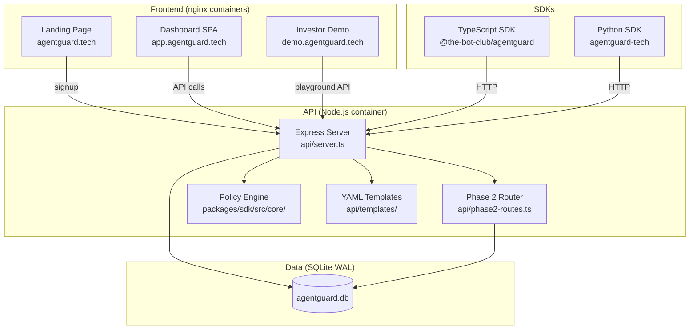

# AgentGuard Architecture Audit Report
**Date:** 2 March 2026 | **Auditor:** Architecture Review

## Executive Summary

AgentGuard is a well-structured, functional runtime security API with solid auth, audit trail integrity, and good test coverage for Phase 0 and Phase 1 features. However, **both SDK clients have critical endpoint path mismatches** that will cause 404s in production, the Phase 2 routes lack test coverage entirely, the dashboard uses real API calls but Phase 2 rate-limit enforcement is not wired into the evaluate endpoint, and several CORS/Dockerfile gaps exist.

---

## Critical Issues (Must Fix)

| # | File | Issue | Impact | Fix |
|---|------|-------|--------|-----|
| C1 | `packages/sdk/src/sdk/client.ts` L170 | `getCostSummary()` calls `/api/v1/cost/summary` but API route is `/api/v1/costs/summary` (plural) | **SDK returns 404 for all cost summary calls** | Change to `/api/v1/costs/summary` |
| C2 | `packages/sdk/src/sdk/client.ts` L180 | `getAgentCosts()` calls `/api/v1/cost/agents` but API route is `/api/v1/costs/agents` (plural) | **SDK returns 404 for agent cost calls** | Change to `/api/v1/costs/agents` |
| C3 | `packages/sdk/src/sdk/client.ts` L200 | `getAgentActivity()` calls `/api/v1/dashboard/activity` but API route is `/api/v1/dashboard/agents` | **SDK returns 404 for agent activity** | Change to `/api/v1/dashboard/agents` |
| C4 | `packages/python/agentguard/client.py` L170 | `get_cost_summary()` calls `/api/v1/cost/summary` — same plural mismatch | **Python SDK 404s on cost summary** | Change to `/api/v1/costs/summary` |
| C5 | `packages/python/agentguard/client.py` L180 | `get_agent_costs()` calls `/api/v1/cost/agents` — same mismatch | **Python SDK 404s on agent costs** | Change to `/api/v1/costs/agents` |
| C6 | `packages/python/agentguard/client.py` L196 | `get_agent_activity()` calls `/api/v1/dashboard/activity` — should be `/api/v1/dashboard/agents` | **Python SDK 404s on agent activity** | Change to `/api/v1/dashboard/agents` |
| C7 | `packages/python/agentguard/client.py` L127 | `create_agent()` sends `policyScope` (camelCase) but API server `POST /api/v1/agents` expects `policy_scope` (snake_case) at L1219 | **Agent creation sends wrong field, policy_scope always defaults to `[]`** | Change SDK to send `policy_scope` or change API to accept both |
| C8 | `packages/sdk/src/sdk/client.ts` L109 | `createAgent()` sends `policyScope` as `Record<string, any>` but API expects `policy_scope` as array | **Same as C7 — TypeScript SDK also sends wrong field name** | Send `policy_scope` and type as `string[]` |
| C9 | `api/server.ts` L1569 | Phase 2 routes mounted with `app.use(createPhase2Routes(db))` **after** the global error handler at L1558 | **Phase 2 errors bypass the error handler; also Phase 2 routes may conflict with the 404 handler** — actually the 404 handler is at L1572, after Phase 2. The error handler at L1558 only catches errors from routes above it. Phase 2 route errors will propagate to Express default handler. | Move `app.use(createPhase2Routes(db))` **before** the error handler |
| C10 | `api/server.ts` | CORS `methods` only allows `['GET', 'POST', 'OPTIONS']` but webhooks and agents use `DELETE` | **DELETE requests from browsers will be CORS-blocked** | Add `'DELETE'` to the methods array |

## Important Issues (Should Fix)

| # | File | Issue | Impact | Fix |
|---|------|-------|--------|-----|
| I1 | `api/phase2-routes.ts` | `makeRequireTenantAuth()` duplicates auth logic from server.ts — doesn't handle `ag_agent_` keys at all | Agent keys will authenticate as regular tenant keys on Phase 2 routes (no 403 guard) | Reuse or import auth middleware from server.ts, or add agent key check |
| I2 | `api/server.ts` | `/api/v1/evaluate` calls `checkRateLimit` import but never actually invokes it. The import exists but custom rate limits created via `POST /api/v1/rate-limits` are **never enforced** during evaluation | Rate limits are CRUD-only — they have no effect | Add `checkRateLimit(db, tenantId, agentId)` check in the evaluate endpoint and call `incrementRateCounter` after |
| I3 | `tests/` | **Zero test coverage for Phase 2 routes**: rate-limits CRUD, costs/track, costs/summary, costs/agents, dashboard/stats, dashboard/feed, dashboard/agents | Regressions will go undetected | Add e2e tests for all Phase 2 endpoints |
| I4 | `api/phase2-routes.ts` L20 | `RateCounterRow` interface is defined but `eslint-disable-next-line @typescript-eslint/no-unused-vars` — dead code | Code clutter | Remove unused interface or use it |
| I5 | `Dockerfile.api` | `npm install` in Dockerfile doesn't use lockfile — `npm install express cors better-sqlite3 js-yaml` installs arbitrary latest versions | Non-reproducible builds; risk of breaking changes | Use `COPY package-lock.json` and `npm ci` |
| I6 | `dashboard/index.html` | Dashboard makes real API calls to `https://agentguard-api.greenrock-adeab1b0.australiaeast.azurecontainerapps.io` — hardcoded URL | If API URL changes, dashboard breaks. Also, dashboard requires API key entered by user, which is good. | Extract API URL to a config variable or use relative proxy |
| I7 | `api/server.ts` | `storeAuditEvent` and playground's in-memory hash chain can **diverge** — playground computes hash from `actionRequest.timestamp` while `storeAuditEvent` uses `new Date().toISOString()` (different timestamp) | Audit verify may show hash mismatches for playground-originated events because the SQLite hash uses a different timestamp than the in-memory one | Use consistent timestamp in both paths |
| I8 | `landing/index.html` | Signup form POSTs to the API and displays the key. The API key is shown once — but the form doesn't mention the dashboard URL from the API response | Users might not know where to go after signup | Show the `dashboard` URL from the signup response |
| I9 | `packages/sdk/src/sdk/client.ts` | `listTemplates()` and `getTemplate()` send `X-API-Key` header but these are public endpoints (no auth required) | Not a bug, but unnecessary header exposure | Minor — could omit API key for public endpoints |
| I10 | `api/phase2-routes.ts` | `POST /api/v1/costs/track` has no rate limiting of its own — a tenant could spam millions of cost events | Storage abuse, potential DoS | Add per-tenant rate limit or cap on cost events |
| I11 | `README.md` | Project structure lists `packages/api/` as "REST route handlers (Prisma-based, legacy)" and `packages/dashboard/` as "Next.js admin dashboard" — these appear to be legacy/nonexistent | Misleading documentation | Remove or mark as deprecated |
| I12 | `README.md` | Env vars section lists `RATE_LIMIT_PER_MIN` and `SIGNUP_RATE_LIMIT_PER_HOUR` but server.ts uses hardcoded constants, not env vars | Documentation lies — these env vars have no effect | Either implement env var reading or remove from docs |
| I13 | `.github/workflows/deploy-azure.yml` | Demo container is never built/deployed — no `demo` change detection or build step | Demo site changes won't deploy via CI | Add demo detection and deploy step |
| I14 | `api/server.ts` | `phase1.test.ts` doesn't use `AG_DB_PATH=:memory:` — it writes to disk at default path | Test state bleeds between runs; may conflict with other tests if run in parallel | Add `AG_DB_PATH: ':memory:'` to phase1 test env |

## Minor Issues (Nice to Fix)

| # | File | Issue | Impact | Fix |
|---|------|-------|--------|-----|
| M1 | `packages/sdk/src/sdk/client.ts` | Heavy use of `any` return types (`Promise<any>`) for most methods | Poor TypeScript DX — users get no type hints | Add proper return type interfaces |
| M2 | `api/server.ts` | `GET /api/v1/evaluate` returns a help message — unconventional for a REST API | Minor confusion | Consider removing or returning 405 |
| M3 | `packages/python/agentguard/client.py` | `create_agent` param `policy_scope` typed as `dict` but API expects array | Type confusion | Change type hint to `list` |
| M4 | `api/templates/*.yaml` | Templates use inconsistent field names (`type: block` vs `action: block` in default policy rules) — templates use `type` and `decision` while the policy engine uses `action` | Templates aren't directly compatible with the policy engine format | Document the difference or normalize |
| M5 | `Dockerfile.landing` | COPYs `blog/` and `reports/` directories — if these don't exist, Docker build fails | Fragile build | Add existence check or document required files |
| M6 | `api/server.ts` L1569 | Phase 2 routes mounted AFTER the 404 handler... wait, let me re-check. Actually: error handler at ~L1558, Phase 2 at ~L1569, 404 at ~L1572. Since Phase 2 is a Router, its routes register before 404. This is actually fine for routing, but error handler ordering is wrong (see C9). | Clarified in C9 | See C9 |
| M7 | `packages/python/pyproject.toml` | No dependencies listed — `requires-python >= 3.8` but uses `f-strings` (3.6+) and no external deps. This is correct since it only uses stdlib. | None | N/A — actually fine |
| M8 | `demo/index.html` | Very large single HTML file (~1770 lines) with inline CSS/JS | Hard to maintain | Consider splitting, though acceptable for a demo |
| M9 | `packages/sdk/src/sdk/client.ts` | `getDashboardFeed` doesn't pass `limit` parameter from options | Users can't control feed size via SDK | Add `limit` to options type and pass as query param |

---

## Architecture Overview

---

## Endpoint Matrix

| Endpoint | Method | Auth | Rate Limited | Test Coverage |
|----------|--------|------|--------------|---------------|
| `/` | GET | None | Global | ✅ e2e |
| `/health` | GET | None | Global | ✅ e2e |
| `/api/v1/signup` | POST | None | 5/hr/IP | ✅ e2e |
| `/api/v1/evaluate` | GET | None | Global | ✅ e2e |
| `/api/v1/evaluate` | POST | Optional | Global | ✅ e2e |
| `/api/v1/audit` | GET | Tenant | Global | ✅ e2e |
| `/api/v1/audit/verify` | GET | Tenant | Global | ✅ e2e |
| `/api/v1/usage` | GET | Tenant | Global | ✅ e2e |
| `/api/v1/killswitch` | GET | Optional | Global | ✅ e2e |
| `/api/v1/killswitch` | POST | Tenant | Global | ✅ e2e |
| `/api/v1/admin/killswitch` | POST | Admin | Global | ✅ e2e |
| `/api/v1/playground/session` | POST | Optional | Global | ✅ e2e |
| `/api/v1/playground/evaluate` | POST | Optional | Global | ✅ e2e |
| `/api/v1/playground/audit/:id` | GET | None | Global | ✅ e2e |
| `/api/v1/playground/policy` | GET | None | Global | ✅ e2e |
| `/api/v1/playground/scenarios` | GET | None | Global | ✅ e2e |
| `/api/v1/webhooks` | POST | Tenant | Global | ✅ phase1 |
| `/api/v1/webhooks` | GET | Tenant | Global | ✅ phase1 |
| `/api/v1/webhooks/:id` | DELETE | Tenant | Global | ✅ phase1 |
| `/api/v1/templates` | GET | None | Global | ✅ phase1 |
| `/api/v1/templates/:name` | GET | None | Global | ✅ phase1 |
| `/api/v1/templates/:name/apply` | POST | Tenant | Global | ✅ phase1 |
| `/api/v1/agents` | POST | Tenant | Global | ✅ phase1 |
| `/api/v1/agents` | GET | Tenant | Global | ✅ phase1 |
| `/api/v1/agents/:id` | DELETE | Tenant | Global | ✅ phase1 |
| `/api/v1/rate-limits` | POST | Tenant* | Global | ❌ NONE |
| `/api/v1/rate-limits` | GET | Tenant* | Global | ❌ NONE |
| `/api/v1/rate-limits/:id` | DELETE | Tenant* | Global | ❌ NONE |
| `/api/v1/costs/track` | POST | Tenant* | Global | ❌ NONE |
| `/api/v1/costs/summary` | GET | Tenant* | Global | ❌ NONE |
| `/api/v1/costs/agents` | GET | Tenant* | Global | ❌ NONE |
| `/api/v1/dashboard/stats` | GET | Tenant* | Global | ❌ NONE |
| `/api/v1/dashboard/feed` | GET | Tenant* | Global | ❌ NONE |
| `/api/v1/dashboard/agents` | GET | Tenant* | Global | ❌ NONE |

\* Phase 2 auth uses its own `makeRequireTenantAuth` — doesn't block agent keys (see I1).

---

## SDK-API Compatibility Matrix

| SDK Method | SDK Path | API Path | Match? |
|------------|----------|----------|--------|
| `evaluate()` | `/api/v1/evaluate` | `/api/v1/evaluate` | ✅ |
| `getUsage()` | `/api/v1/usage` | `/api/v1/usage` | ✅ |
| `getAudit()` | `/api/v1/audit` | `/api/v1/audit` | ✅ |
| `killSwitch()` | `/api/v1/killswitch` | `/api/v1/killswitch` | ✅ |
| `createWebhook()` | `/api/v1/webhooks` | `/api/v1/webhooks` | ✅ |
| `listWebhooks()` | `/api/v1/webhooks` | `/api/v1/webhooks` | ✅ |
| `deleteWebhook()` | `/api/v1/webhooks/:id` | `/api/v1/webhooks/:id` | ✅ |
| `createAgent()` | `/api/v1/agents` | `/api/v1/agents` | ⚠️ Field name mismatch (`policyScope` vs `policy_scope`) |
| `listAgents()` | `/api/v1/agents` | `/api/v1/agents` | ✅ |
| `deleteAgent()` | `/api/v1/agents/:id` | `/api/v1/agents/:id` | ✅ |
| `listTemplates()` | `/api/v1/templates` | `/api/v1/templates` | ✅ |
| `getTemplate()` | `/api/v1/templates/:name` | `/api/v1/templates/:name` | ✅ |
| `applyTemplate()` | `/api/v1/templates/:name/apply` | `/api/v1/templates/:name/apply` | ✅ |
| `setRateLimit()` | `/api/v1/rate-limits` | `/api/v1/rate-limits` | ✅ |
| `listRateLimits()` | `/api/v1/rate-limits` | `/api/v1/rate-limits` | ✅ |
| `deleteRateLimit()` | `/api/v1/rate-limits/:id` | `/api/v1/rate-limits/:id` | ✅ |
| **`getCostSummary()`** | **`/api/v1/cost/summary`** | **`/api/v1/costs/summary`** | **❌ 404** |
| **`getAgentCosts()`** | **`/api/v1/cost/agents`** | **`/api/v1/costs/agents`** | **❌ 404** |
| `getDashboardStats()` | `/api/v1/dashboard/stats` | `/api/v1/dashboard/stats` | ✅ |
| `getDashboardFeed()` | `/api/v1/dashboard/feed` | `/api/v1/dashboard/feed` | ✅ |
| **`getAgentActivity()`** | **`/api/v1/dashboard/activity`** | **`/api/v1/dashboard/agents`** | **❌ 404** |
| `verifyAudit()` (Python only) | `/api/v1/audit/verify` | `/api/v1/audit/verify` | ✅ |
| `trackCost()` | N/A — **missing from both SDKs** | `/api/v1/costs/track` | ❌ Missing |

---

## Security Assessment

### Auth Model
- **Good**: Three-tier auth (none/tenant/admin) with clear separation
- **Good**: Agent keys (`ag_agent_`) cannot access tenant admin endpoints (403)
- **Good**: API keys use `ag_live_` and `ag_agent_` prefixes for easy identification
- **Issue**: Phase 2 routes use duplicated auth that doesn't block agent keys (I1)

### Input Validation
- **Good**: Tool name length capped at 200 chars
- **Good**: JSON body size limited to 50kb
- **Good**: Email format validation on signup
- **Good**: Malformed JSON returns 400
- **Issue**: No input sanitization on webhook URLs beyond basic regex (could store XSS payloads in URL field)
- **Issue**: `policy_scope` in agent creation accepts arbitrary JSON arrays with no validation

### Rate Limiting
- **Good**: Global 100 req/min per IP
- **Good**: Signup limited to 5/hr/IP
- **Critical Gap**: Custom rate limits (Phase 2) are CRUD-only — never enforced (I2)
- **Issue**: Cost tracking endpoint has no rate limit of its own (I10)

### CORS
- **Good**: Allowlist-based with regex for Azure Container Apps
- **Critical Gap**: DELETE method not in allowed methods (C10)
- **Good**: Localhost allowed for development

### Headers
- **Good**: X-Powered-By disabled, X-Frame-Options DENY, nosniff, Referrer-Policy, Permissions-Policy

---

## Test Coverage Assessment

| Area | File | Coverage | Gaps |
|------|------|----------|------|
| Policy Engine | `tests/unit.test.ts` | **Excellent** — all 7 rules, edge cases, compiler, constraints | None significant |
| Core API | `tests/e2e.test.ts` | **Good** — health, signup, evaluate, audit, kill switch, playground, CORS, 404s | Missing: webhook e2e, template e2e |
| Phase 1 | `tests/phase1.test.ts` | **Good** — templates, webhooks, agents, backward compat | Missing: AG_DB_PATH=:memory: (I14) |
| Phase 2 | — | **ZERO** | All 9 Phase 2 endpoints untested |
| SDKs | — | **ZERO** | No SDK tests at all |
| Frontend | — | **ZERO** | No frontend tests (acceptable for static pages) |

---

## Recommendations

### Priority 1 — Fix Before Next Deploy
1. **Fix SDK endpoint paths** (C1-C6) — 5 minute fix, prevents all cost/dashboard SDK calls from 404ing
2. **Fix SDK field name mismatch** (C7-C8) — `policyScope` → `policy_scope` in both SDKs  
3. **Add DELETE to CORS methods** (C10) — one-line fix
4. **Move Phase 2 route mounting before error handler** (C9) — one-line move

### Priority 2 — Fix This Week
5. **Wire up rate limit enforcement** in evaluate endpoint (I2) — the entire rate-limit feature is currently non-functional
6. **Add Phase 2 e2e tests** (I3) — 9 endpoints with zero coverage
7. **Fix Phase 2 auth to block agent keys** (I1) — agent keys currently bypass tenant-only restrictions on Phase 2 routes
8. **Fix Dockerfile to use lockfile** (I5) — reproducible builds

### Priority 3 — Fix This Sprint
9. **Add `trackCost()` method to both SDKs** — API endpoint exists but neither SDK exposes it
10. **Fix README env var claims** (I12) — either implement env var reading or remove from docs
11. **Add demo to CI/CD pipeline** (I13)
12. **Fix audit hash divergence** (I7) — playground vs SQLite timestamps differ
13. **Clean up README project structure** (I11) — remove references to nonexistent legacy packages
