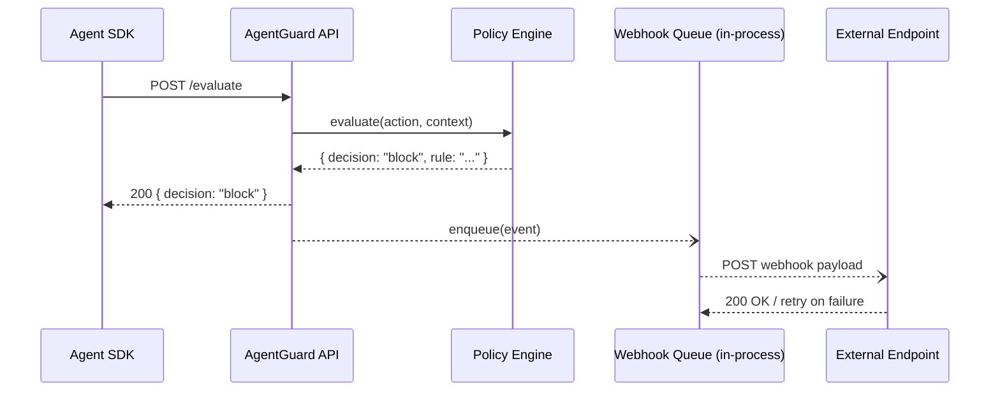
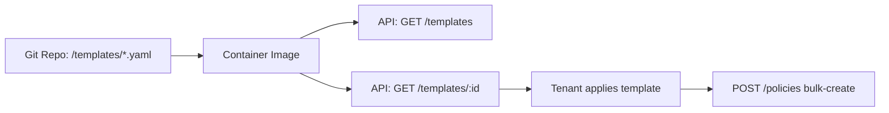
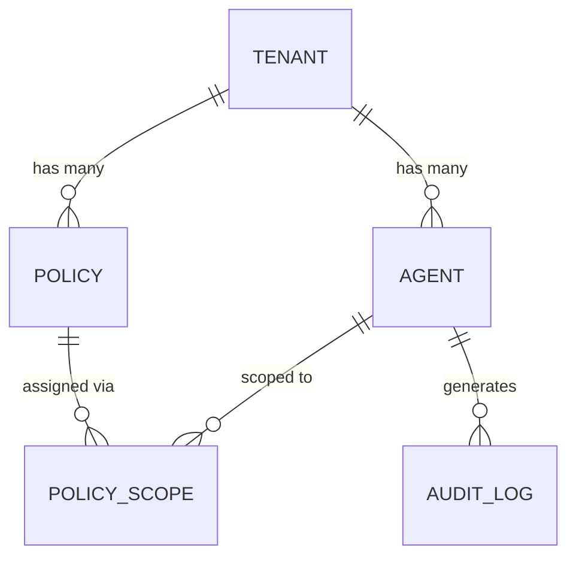
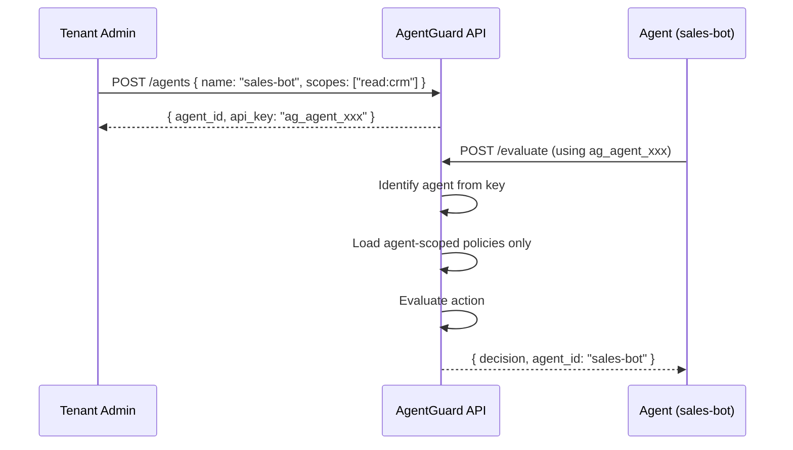
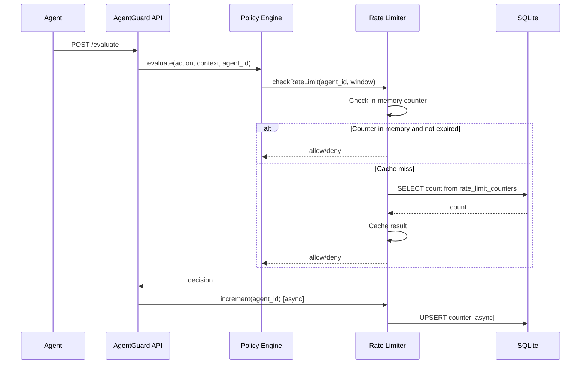
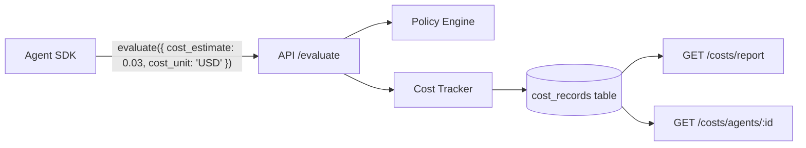
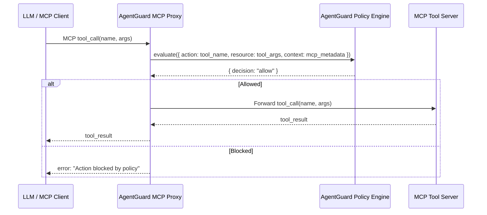
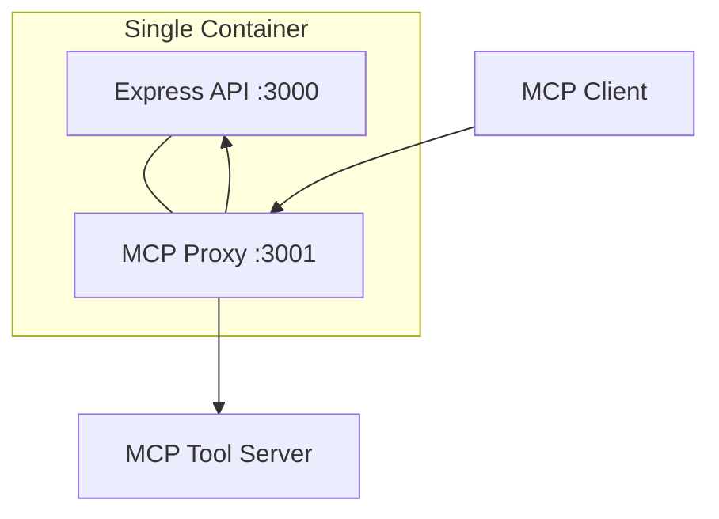
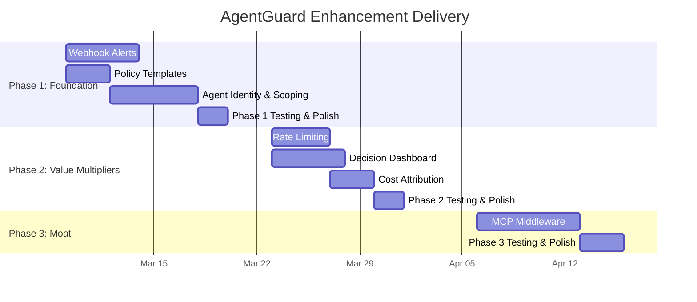
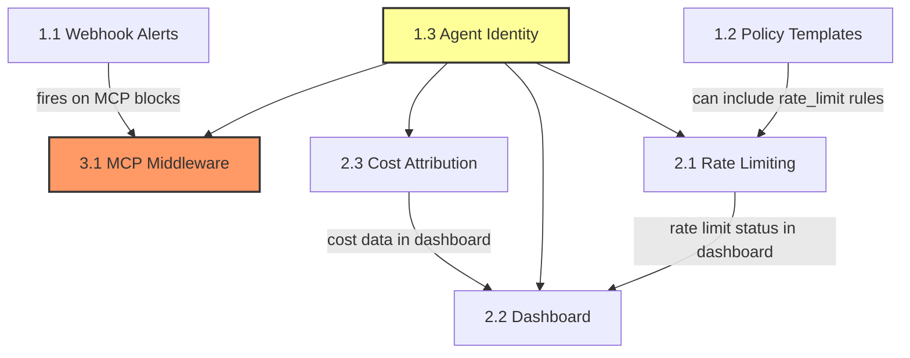

# AgentGuard Enhancement Implementation Plan

> **Version:** 1.0 · **Date:** 2 March 2026 · **Status:** Draft for Board Review
> **Prepared by:** Solutions Architecture & Business Analysis

---

## Table of Contents

1. [Executive Summary](#executive-summary)
2. [Architecture Principles](#architecture-principles)
3. [Phase 1 — Foundation (Week 1–2)](#phase-1--foundation-week-12)
   - [1.1 Webhook Alerts](#11-webhook-alerts)
   - [1.2 Pre-built Policy Templates](#12-pre-built-policy-templates)
   - [1.3 Agent Identity & Scoping](#13-agent-identity--scoping)
4. [Phase 2 — Value Multipliers (Week 3–4)](#phase-2--value-multipliers-week-34)
   - [2.1 Rate Limiting](#21-rate-limiting)
   - [2.2 Decision Dashboard (Real-time)](#22-decision-dashboard-real-time)
   - [2.3 Cost Attribution](#23-cost-attribution)
5. [Phase 3 — Moat (Week 5–6)](#phase-3--moat-week-56)
   - [3.1 MCP Middleware](#31-mcp-model-context-protocol-middleware)
6. [Delivery Overview](#delivery-overview)
7. [Testing Strategy](#testing-strategy)
8. [Rollout Strategy](#rollout-strategy)
9. [Backward Compatibility Guarantees](#backward-compatibility-guarantees)
10. [Documentation Requirements](#documentation-requirements)

---

## Executive Summary

This plan details seven enhancements to AgentGuard across three phases over six weeks. The enhancements transform AgentGuard from a policy-evaluation API into a full-lifecycle runtime security platform with alerting, compliance templates, granular agent identity, rate limiting, real-time observability, cost governance, and native MCP integration.

**Investment:** ~6 weeks · 1–2 engineers · 0 new infrastructure services (SQLite only, single container)

**Expected outcomes:**
- Unlock Enterprise tier ($499+/mo) with webhook alerts, agent scoping, rate limiting
- Reduce onboarding friction via compliance-ready policy templates
- Create defensible moat via MCP middleware (first-mover in agentic security)
- Enable usage-based pricing via cost attribution

---

## Architecture Principles

| Principle | Constraint |
|---|---|
| Database | SQLite only — no PostgreSQL |
| Compatibility | All existing endpoints backward compatible |
| Demo mode | Playground/demo stays public, no auth required |
| Performance | Sub-millisecond policy evaluation maintained |
| Deployment | Single deployable container (API) |
| Dependencies | Minimal new packages — prefer stdlib/existing |

---

## Phase 1 — Foundation (Week 1–2)

---

### 1.1 Webhook Alerts

#### Architect Section

**System Design**

Webhook alerts fire asynchronously after policy decisions that result in `block`, `hitl_required`, or `killswitch_active` outcomes. Delivery is fire-and-forget from the hot path; a background queue ensures retries without impacting evaluation latency.



**Components:**
- `WebhookService` — manages CRUD for webhook configs, enqueues events
- `WebhookWorker` — in-process setInterval (1s) drains queue, delivers with retry (3 attempts, exponential backoff: 1s, 5s, 25s)
- No external queue dependency — SQLite table acts as persistent queue

**Database Schema**

```sql
CREATE TABLE webhooks (
    id TEXT PRIMARY KEY DEFAULT (lower(hex(randomblob(16)))),
    tenant_id TEXT NOT NULL REFERENCES tenants(id),
    url TEXT NOT NULL,
    secret TEXT,                    -- HMAC-SHA256 signing secret
    event_types TEXT NOT NULL,      -- JSON array: ["block","hitl","killswitch"]
    enabled INTEGER NOT NULL DEFAULT 1,
    created_at TEXT NOT NULL DEFAULT (datetime('now')),
    updated_at TEXT NOT NULL DEFAULT (datetime('now'))
);

CREATE TABLE webhook_deliveries (
    id TEXT PRIMARY KEY DEFAULT (lower(hex(randomblob(16)))),
    webhook_id TEXT NOT NULL REFERENCES webhooks(id),
    event_type TEXT NOT NULL,
    payload TEXT NOT NULL,          -- JSON
    status TEXT NOT NULL DEFAULT 'pending',  -- pending | delivered | failed
    attempts INTEGER NOT NULL DEFAULT 0,
    last_attempt_at TEXT,
    response_code INTEGER,
    next_retry_at TEXT,
    created_at TEXT NOT NULL DEFAULT (datetime('now'))
);

CREATE INDEX idx_deliveries_status ON webhook_deliveries(status, next_retry_at);
```

**API Contract**

| Method | Endpoint | Description |
|---|---|---|
| `POST` | `/webhooks` | Create webhook config |
| `GET` | `/webhooks` | List tenant's webhooks |
| `PUT` | `/webhooks/:id` | Update webhook |
| `DELETE` | `/webhooks/:id` | Delete webhook |
| `POST` | `/webhooks/:id/test` | Send test event |

**Request — `POST /webhooks`**
```json
{
  "url": "https://hooks.slack.com/services/T00/B00/xxx",
  "secret": "whsec_optional_signing_key",
  "event_types": ["block", "hitl", "killswitch"]
}
```

**Response — `201 Created`**
```json
{
  "id": "wh_abc123",
  "url": "https://hooks.slack.com/services/T00/B00/xxx",
  "event_types": ["block", "hitl", "killswitch"],
  "enabled": true,
  "created_at": "2026-03-10T12:00:00Z"
}
```

**Webhook Payload (POST to customer URL):**
```json
{
  "event_id": "evt_xyz",
  "event_type": "block",
  "timestamp": "2026-03-10T12:00:01Z",
  "tenant_id": "t_abc",
  "data": {
    "decision": "block",
    "action": "send_email",
    "resource": "customer_pii",
    "rule_matched": "block-pii-external",
    "agent_id": "agent_sales_bot",
    "context": {}
  }
}
```

**Headers on delivery:**
```
Content-Type: application/json
X-AgentGuard-Event: block
X-AgentGuard-Signature: sha256=<HMAC-SHA256 of body using secret>
X-AgentGuard-Delivery: del_xyz
```

**SDK Changes**

*TypeScript:*
```typescript
client.webhooks.create({ url, eventTypes, secret? })
client.webhooks.list()
client.webhooks.update(id, { url?, eventTypes?, enabled? })
client.webhooks.delete(id)
client.webhooks.test(id)
```

*Python:*
```python
client.webhooks.create(url=..., event_types=[...], secret=...)
client.webhooks.list()
client.webhooks.update(id, url=..., event_types=[...], enabled=...)
client.webhooks.delete(id)
client.webhooks.test(id)
```

**Security Considerations**
- HMAC-SHA256 signature on every delivery (optional but recommended)
- Webhook URLs validated: must be HTTPS (HTTP allowed only for localhost in dev)
- Secrets stored encrypted at rest (AES-256 with tenant-scoped key)
- Rate limit on webhook creation: 10 per tenant
- Payload never includes raw API keys

**Infrastructure/Deployment Impact**
- Zero — in-process queue, SQLite storage, single container unchanged
- Outbound HTTPS from container must be allowed (already is for any internet-facing API)

**Integration Points**
- Hook into existing `evaluate()` response path in `server.ts` — after decision is returned, call `webhookService.enqueue(tenantId, eventType, payload)`
- Reuse existing auth middleware for webhook CRUD endpoints

**Performance Considerations**
- Enqueue is a single SQLite INSERT — <0.1ms
- Delivery is async, off the hot path — zero impact on `/evaluate` latency
- Worker processes max 50 deliveries per tick to avoid blocking event loop
- Old deliveries pruned after 7 days via daily cleanup

#### BA Section

**User Stories**

| # | Story |
|---|---|
| W1 | As a **security engineer**, I want to receive a Slack alert when an agent action is blocked, so that I can investigate immediately. |
| W2 | As a **platform admin**, I want to configure multiple webhook endpoints per tenant, so that alerts go to both Slack and PagerDuty. |
| W3 | As a **developer**, I want to verify my webhook integration with a test event, so that I can confirm delivery before going live. |
| W4 | As a **compliance officer**, I want HMAC-signed webhook payloads, so that I can verify alerts are authentic. |

**Acceptance Criteria**

| Given | When | Then |
|---|---|---|
| A tenant has a webhook configured for "block" events | An agent action is blocked by the policy engine | A POST is sent to the webhook URL within 5 seconds containing the decision payload |
| A webhook delivery fails (non-2xx) | The worker processes the retry queue | It retries up to 3 times with exponential backoff (1s, 5s, 25s) |
| A tenant calls POST /webhooks/:id/test | — | A test event is delivered to the URL and the response status is returned |
| A webhook has a secret configured | A delivery is sent | The X-AgentGuard-Signature header contains a valid HMAC-SHA256 of the body |

**Business Value**
- Bridges AgentGuard into existing SOC/incident response workflows
- Table-stakes feature for Enterprise sales — every competitor has it
- Enables "closed-loop" security: detect → alert → respond

**Success Metrics**
| KPI | Target |
|---|---|
| Webhook adoption (% of paid tenants with ≥1 webhook) | 40% within 60 days |
| Median delivery latency | < 3 seconds |
| Delivery success rate | > 99.5% |

**Pricing Impact**
| Tier | Access |
|---|---|
| Free | 1 webhook, block events only |
| Pro ($49/mo) | 5 webhooks, all event types |
| Enterprise ($499/mo) | Unlimited webhooks, custom headers, IP allowlisting |

**Customer Segments:** DevOps teams, SOC teams, compliance-heavy orgs (fintech, healthcare)

**Risk Assessment**
| Risk | Likelihood | Impact | Mitigation |
|---|---|---|---|
| Webhook URL is down → delivery backlog | Medium | Low | Retry + TTL; prune after 7 days |
| Customer configures slow endpoint → queue backs up | Low | Medium | 5s timeout per delivery; circuit breaker after 5 consecutive failures |
| Secrets leaked in logs | Low | High | Never log secrets; redact in error messages |

**Dependencies:** None — fully standalone feature.

---

### 1.2 Pre-built Policy Templates

#### Architect Section

**System Design**

Policy templates are static YAML files bundled in the container image under `/templates/`. An API endpoint serves them. No runtime generation — templates are version-controlled in the repo.



**Template Format (YAML)**
```yaml
id: soc2-starter
name: "SOC 2 Starter"
version: "1.0"
description: "Baseline policies for SOC 2 Type II compliance"
category: compliance
tags: [soc2, audit, access-control]
rules:
  - name: block-pii-external
    type: resource_block
    action: send_*
    resource: "*_pii"
    decision: block
    description: "Block sending PII to external systems"
  - name: hitl-financial-write
    type: hitl
    action: write_*
    resource: financial_*
    decision: hitl_required
    description: "Require human approval for financial writes"
  # ... more rules
```

**Database Schema**

No schema changes needed. Templates are static files. When a tenant "applies" a template, the client calls existing `POST /policies` for each rule — no new tables required.

Optionally, track which templates a tenant has applied:

```sql
CREATE TABLE applied_templates (
    id TEXT PRIMARY KEY DEFAULT (lower(hex(randomblob(16)))),
    tenant_id TEXT NOT NULL REFERENCES tenants(id),
    template_id TEXT NOT NULL,
    template_version TEXT NOT NULL,
    applied_at TEXT NOT NULL DEFAULT (datetime('now'))
);
```

**API Contract**

| Method | Endpoint | Auth | Description |
|---|---|---|---|
| `GET` | `/templates` | Public | List all available templates |
| `GET` | `/templates/:id` | Public | Get template detail + rules |
| `POST` | `/templates/:id/apply` | Tenant key | Apply template → creates policies |

**Response — `GET /templates`**
```json
[
  {
    "id": "soc2-starter",
    "name": "SOC 2 Starter",
    "version": "1.0",
    "description": "Baseline policies for SOC 2 Type II compliance",
    "category": "compliance",
    "rule_count": 12,
    "tags": ["soc2", "audit"]
  }
]
```

**Response — `POST /templates/:id/apply`**
```json
{
  "applied": true,
  "template_id": "soc2-starter",
  "policies_created": 12,
  "policies_skipped": 2,
  "skipped_reason": "duplicate rule names"
}
```

**SDK Changes**

*TypeScript:*
```typescript
client.templates.list()
client.templates.get(id)
client.templates.apply(id)  // creates policies from template
```

*Python:*
```python
client.templates.list()
client.templates.get(id)
client.templates.apply(id)
```

**Template Library (v1)**

| Template ID | Name | Rules | Audience |
|---|---|---|---|
| `soc2-starter` | SOC 2 Starter | ~12 | SaaS, cloud-native |
| `apra-cps234` | APRA CPS 234 | ~15 | Australian financial services |
| `eu-ai-act` | EU AI Act Baseline | ~10 | Any EU-deployed agent |
| `owasp-agentic-top10` | OWASP Agentic Top 10 | ~10 | Security-conscious devs |
| `financial-services` | Financial Services | ~18 | Banks, insurance, payments |

**Security Considerations**
- Templates are read-only static files — no injection risk
- `apply` endpoint uses existing policy creation auth — no new auth surface
- Template content reviewed and signed off by security team before inclusion

**Infrastructure/Deployment Impact**
- Templates bundled in container image (~50KB YAML total)
- No external service dependencies

**Integration Points**
- `apply` endpoint internally calls existing `createPolicy()` function in a loop
- Reuse existing policy validation logic

**Performance Considerations**
- `GET /templates` serves from in-memory cache (loaded at startup)
- `apply` creates policies in a single SQLite transaction — fast even for 20 rules

#### BA Section

**User Stories**

| # | Story |
|---|---|
| T1 | As a **new customer**, I want to apply a SOC 2 policy template in one click, so that I have sensible defaults without writing rules from scratch. |
| T2 | As a **compliance officer**, I want to see which compliance framework each template maps to, so that I can choose the right one for our audit. |
| T3 | As a **developer**, I want to download templates via API, so that I can review rules before applying them. |

**Acceptance Criteria**

| Given | When | Then |
|---|---|---|
| A tenant visits GET /templates | — | All available templates are listed with name, description, and rule count |
| A tenant calls POST /templates/soc2-starter/apply | — | All rules from the template are created as policies; duplicates are skipped |
| A template is applied twice | — | No duplicate policies; skipped count is returned |

**Business Value**
- Reduces time-to-value from hours to seconds
- Positions AgentGuard as compliance-aware (not just security tooling)
- Content marketing asset: "AgentGuard ships with SOC 2 policies out of the box"

**Success Metrics**
| KPI | Target |
|---|---|
| Template adoption (% of new tenants who apply ≥1 template in first 7 days) | 60% |
| Support tickets about "how to write policies" | ↓ 50% |

**Pricing Impact**
| Tier | Access |
|---|---|
| Free | All templates (drives adoption) |
| Pro | All templates |
| Enterprise | All templates + custom template creation (future) |

**Customer Segments:** New customers, compliance-driven orgs, teams without security expertise

**Risk Assessment**
| Risk | Likelihood | Impact | Mitigation |
|---|---|---|---|
| Templates become outdated vs. regulations | Medium | Medium | Version templates; review quarterly |
| Customers assume templates = full compliance | Medium | High | Clear disclaimers; templates are "starter" not "complete" |

**Dependencies:** None.

---

### 1.3 Agent Identity & Scoping

#### Architect Section

**System Design**

Introduces a new entity: **Agent**. Each tenant can create multiple agents, each with its own API key (`ag_agent_<hash>`), policy scope, and audit trail. The existing tenant key (`ag_<hash>`) becomes the "admin key" — it can manage agents and policies. Agent keys can only call `/evaluate` and see their own audit logs.





**Database Schema**

```sql
CREATE TABLE agents (
    id TEXT PRIMARY KEY DEFAULT (lower(hex(randomblob(16)))),
    tenant_id TEXT NOT NULL REFERENCES tenants(id),
    name TEXT NOT NULL,
    api_key_hash TEXT NOT NULL UNIQUE,  -- SHA-256 of ag_agent_xxx
    api_key_prefix TEXT NOT NULL,       -- first 8 chars for display
    description TEXT,
    enabled INTEGER NOT NULL DEFAULT 1,
    created_at TEXT NOT NULL DEFAULT (datetime('now')),
    updated_at TEXT NOT NULL DEFAULT (datetime('now')),
    UNIQUE(tenant_id, name)
);

CREATE TABLE agent_policy_scopes (
    agent_id TEXT NOT NULL REFERENCES agents(id) ON DELETE CASCADE,
    policy_id TEXT NOT NULL REFERENCES policies(id) ON DELETE CASCADE,
    PRIMARY KEY (agent_id, policy_id)
);

-- Add agent_id column to audit_log
ALTER TABLE audit_log ADD COLUMN agent_id TEXT REFERENCES agents(id);

CREATE INDEX idx_audit_agent ON audit_log(agent_id);
CREATE INDEX idx_agents_tenant ON agents(tenant_id);
CREATE INDEX idx_agents_key ON agents(api_key_hash);
```

**API Contract**

| Method | Endpoint | Auth | Description |
|---|---|---|---|
| `POST` | `/agents` | Admin key | Create agent |
| `GET` | `/agents` | Admin key | List agents |
| `GET` | `/agents/:id` | Admin key | Get agent detail |
| `PUT` | `/agents/:id` | Admin key | Update agent |
| `DELETE` | `/agents/:id` | Admin key | Delete agent (revoke key) |
| `POST` | `/agents/:id/rotate-key` | Admin key | Rotate agent API key |
| `GET` | `/agents/:id/audit` | Admin key | Agent-filtered audit trail |

**Request — `POST /agents`**
```json
{
  "name": "sales-bot",
  "description": "Handles CRM reads and customer outreach",
  "policy_ids": ["pol_abc", "pol_def"]
}
```

**Response — `201 Created`**
```json
{
  "id": "agt_xyz",
  "name": "sales-bot",
  "api_key": "ag_agent_a1b2c3d4e5f6...",
  "api_key_prefix": "ag_agent_a1",
  "policy_ids": ["pol_abc", "pol_def"],
  "created_at": "2026-03-12T10:00:00Z"
}
```

> ⚠️ `api_key` is returned only on creation and rotation — never again.

**Changes to `/evaluate`:**
- Accept both tenant keys (`ag_`) and agent keys (`ag_agent_`)
- When agent key is used: load only scoped policies, tag audit log with `agent_id`
- When tenant key is used: load all policies (backward compatible)

**SDK Changes**

*TypeScript:*
```typescript
// Admin operations
client.agents.create({ name, description?, policyIds? })
client.agents.list()
client.agents.get(id)
client.agents.update(id, { name?, description?, policyIds?, enabled? })
client.agents.delete(id)
client.agents.rotateKey(id)

// Agent-scoped client
const agentClient = new AgentGuard({ apiKey: "ag_agent_xxx" })
agentClient.evaluate({ action, resource, context })  // scoped automatically
```

*Python:*
```python
client.agents.create(name=..., policy_ids=[...])
client.agents.list()
# ... same pattern

agent_client = AgentGuard(api_key="ag_agent_xxx")
agent_client.evaluate(action=..., resource=..., context={})
```

**Security Considerations**
- Agent keys have strictly less privilege than tenant keys — can only evaluate and read own audit
- Key rotation immediately invalidates old key
- Agent keys use same hashing (SHA-256) as tenant keys
- Deleting an agent revokes its key instantly
- Agent key prefix `ag_agent_` prevents confusion with tenant keys

**Infrastructure/Deployment Impact**
- Zero — new tables in existing SQLite DB, same container

**Integration Points**
- Modify auth middleware in `server.ts` to check both `ag_` and `ag_agent_` prefixes
- Modify `evaluate()` to accept optional agent context and filter policies
- Modify audit log writes to include `agent_id`

**Performance Considerations**
- Agent key lookup: single indexed query on `api_key_hash` — <0.1ms
- Policy scoping: JOIN on `agent_policy_scopes` — marginal overhead, still sub-millisecond
- No impact when using tenant key (existing path unchanged)

#### BA Section

**User Stories**

| # | Story |
|---|---|
| A1 | As a **platform admin**, I want to create separate API keys for each agent, so that I can control what each agent is allowed to do. |
| A2 | As a **security engineer**, I want to scope policies per agent, so that "sales-bot" can read CRM but not access payments. |
| A3 | As a **auditor**, I want to filter audit logs by agent, so that I can review what a specific agent did. |
| A4 | As a **platform admin**, I want to rotate an agent's API key without downtime, so that I can respond to key compromise. |
| A5 | As a **platform admin**, I want to disable an agent without deleting it, so that I can temporarily suspend access. |

**Acceptance Criteria**

| Given | When | Then |
|---|---|---|
| A tenant creates an agent with policies [A, B] | The agent calls /evaluate | Only policies A and B are evaluated |
| An agent key is used to call /evaluate | The audit log is queried | The entry includes the agent_id |
| An agent is disabled (enabled=false) | The agent calls /evaluate | A 403 is returned |
| A tenant key calls /evaluate (no agent) | — | All tenant policies are evaluated (backward compatible) |

**Business Value**
- Enables least-privilege for multi-agent architectures — core security principle
- Required for Enterprise: "our compliance team won't approve a single shared key for all agents"
- Foundation for rate limiting and cost attribution (both key on agent_id)

**Success Metrics**
| KPI | Target |
|---|---|
| % of paid tenants using ≥2 agents | 30% within 90 days |
| Agent-scoped evaluations as % of total | 50% within 90 days |

**Pricing Impact**
| Tier | Access |
|---|---|
| Free | 1 agent |
| Pro ($49/mo) | 10 agents |
| Enterprise ($499/mo) | Unlimited agents |

**Customer Segments:** Multi-agent platforms, enterprise with compliance requirements, teams deploying agents across departments

**Risk Assessment**
| Risk | Likelihood | Impact | Mitigation |
|---|---|---|---|
| Migration confusion (existing users on tenant key) | Medium | Low | Tenant key keeps working unchanged; agents are additive |
| Key management complexity | Low | Low | Clear docs; SDK handles key type detection |

**Dependencies:** None, but enables Rate Limiting (2.1) and Cost Attribution (2.3).

---

## Phase 2 — Value Multipliers (Week 3–4)

---

### 2.1 Rate Limiting

#### Architect Section

**System Design**

Rate limiting is implemented as a new policy rule type (`rate_limit`) evaluated inline during `/evaluate`. Uses a sliding window counter stored in SQLite with an in-memory cache layer for hot-path performance.



**Database Schema**

```sql
CREATE TABLE rate_limit_rules (
    id TEXT PRIMARY KEY DEFAULT (lower(hex(randomblob(16)))),
    tenant_id TEXT NOT NULL REFERENCES tenants(id),
    agent_id TEXT REFERENCES agents(id),  -- NULL = applies to all agents
    window_type TEXT NOT NULL,             -- 'minute' | 'hour'
    max_count INTEGER NOT NULL,
    rule_scope TEXT,                        -- action pattern, e.g. 'write_*'
    enabled INTEGER NOT NULL DEFAULT 1,
    created_at TEXT NOT NULL DEFAULT (datetime('now'))
);

CREATE TABLE rate_limit_counters (
    agent_id TEXT NOT NULL,
    window_key TEXT NOT NULL,              -- e.g. '2026-03-10T12:05' (minute) or '2026-03-10T12' (hour)
    count INTEGER NOT NULL DEFAULT 0,
    PRIMARY KEY (agent_id, window_key)
);

-- Cleanup: DELETE FROM rate_limit_counters WHERE window_key < datetime('now', '-2 hours')
```

**In-Memory Cache Design:**
```typescript
// Simple Map with TTL — no Redis needed
const counters = new Map<string, { count: number; expiresAt: number }>()
// Key format: `${agentId}:${windowType}:${windowKey}`
// TTL: 60s for minute windows, 3600s for hour windows
```

**API Contract**

| Method | Endpoint | Description |
|---|---|---|
| `POST` | `/rate-limits` | Create rate limit rule |
| `GET` | `/rate-limits` | List rate limit rules |
| `PUT` | `/rate-limits/:id` | Update rule |
| `DELETE` | `/rate-limits/:id` | Delete rule |
| `GET` | `/rate-limits/status/:agentId` | Current usage vs limits |

**Request — `POST /rate-limits`**
```json
{
  "agent_id": "agt_xyz",
  "window_type": "minute",
  "max_count": 100,
  "rule_scope": "write_*"
}
```

**Response — `GET /rate-limits/status/:agentId`**
```json
{
  "agent_id": "agt_xyz",
  "limits": [
    {
      "window_type": "minute",
      "max_count": 100,
      "current_count": 42,
      "remaining": 58,
      "resets_at": "2026-03-10T12:06:00Z"
    }
  ]
}
```

**Changes to `/evaluate` response (when rate limited):**
```json
{
  "decision": "block",
  "reason": "rate_limit_exceeded",
  "rate_limit": {
    "window_type": "minute",
    "max_count": 100,
    "current_count": 101,
    "retry_after_seconds": 18
  }
}
```

**SDK Changes**

*TypeScript:*
```typescript
client.rateLimits.create({ agentId?, windowType, maxCount, ruleScope? })
client.rateLimits.list()
client.rateLimits.status(agentId)
// evaluate() response now includes rate_limit field when applicable
```

*Python:*
```python
client.rate_limits.create(agent_id=..., window_type=..., max_count=...)
client.rate_limits.status(agent_id)
```

**Security Considerations**
- Rate limit counters are per-agent — one agent can't exhaust another's quota
- Admin key bypasses rate limits (for management operations)
- Counter manipulation requires admin key

**Infrastructure/Deployment Impact**
- In-memory cache means counters reset on container restart — acceptable for sliding windows (self-healing)
- No new services; single container unchanged

**Integration Points**
- New rule type in policy engine `evaluate()` — checked after standard policy rules
- Reuse agent identity from 1.3

**Performance Considerations**
- Hot path: in-memory Map lookup — <0.01ms
- Counter increment: async SQLite UPSERT — off critical path
- Memory: ~100 bytes per active agent-window combo — negligible even at 10K agents
- Sub-millisecond evaluation maintained ✅

#### BA Section

**User Stories**

| # | Story |
|---|---|
| R1 | As a **platform admin**, I want to set a max calls/minute per agent, so that a runaway agent can't overwhelm downstream systems. |
| R2 | As a **finance lead**, I want to set cost/hour ceilings, so that an agent bug doesn't generate a $10K API bill overnight. |
| R3 | As a **developer**, I want to see current rate limit status for my agent, so that I can implement backoff logic. |

**Acceptance Criteria**

| Given | When | Then |
|---|---|---|
| Agent "bot-1" has a 100/min rate limit | bot-1 makes its 101st call in the current minute | Decision is "block" with reason "rate_limit_exceeded" and retry_after |
| The minute window expires | bot-1 makes a new call | Decision proceeds normally |
| No rate limit is configured for an agent | The agent calls /evaluate | Rate limiting is skipped (backward compatible) |

**Business Value**
- Prevents runaway agents — #1 fear of enterprise AI adopters
- Enables usage-based pricing tiers
- Differentiator: most policy engines don't include rate limiting

**Success Metrics**
| KPI | Target |
|---|---|
| % of Enterprise tenants with rate limits configured | 70% within 60 days |
| Rate-limit blocks as % of total blocks | Tracked (indicates real-world value) |

**Pricing Impact**
| Tier | Access |
|---|---|
| Free | 1 rate limit rule (100/min fixed) |
| Pro | 10 rules, configurable windows |
| Enterprise | Unlimited rules, cost/hour ceiling |

**Customer Segments:** Enterprise risk teams, fintech, any org deploying autonomous agents

**Risk Assessment**
| Risk | Likelihood | Impact | Mitigation |
|---|---|---|---|
| Counter desync on container restart | Medium | Low | Self-heals within one window period |
| Clock skew in multi-instance (future) | Low (single container now) | Medium | Document single-instance assumption |

**Dependencies:** Agent Identity (1.3) — rate limits key on agent_id.

---

### 2.2 Decision Dashboard (Real-time)

#### Architect Section

**System Design**

The existing dashboard is wired to real API data via Server-Sent Events (SSE) for the live feed and REST endpoints for aggregations. SSE is chosen over WebSocket for simplicity — unidirectional data flow, works through proxies, auto-reconnect built into EventSource API.

```mermaid
flowchart TB
    subgraph API Container
        A[Express API] --> B[SSE Endpoint]
        A --> C[Aggregation Endpoints]
        A --> D[EventEmitter bus]
        D --> B
    end
    subgraph Dashboard SPA
        E[Live Feed Component] -->|SSE| B
        F[Charts / Stats] -->|REST poll 30s| C
    end
    G[/evaluate calls] --> D
```

**Components:**
- `EventBus` — Node.js EventEmitter; `/evaluate` emits decision events
- `GET /stream/decisions` — SSE endpoint; streams decisions in real-time
- `GET /dashboard/stats` — Aggregated stats (top blocked, policy hit rates, agent breakdown)
- Dashboard SPA updated to consume real data (currently mock data)

**Database Schema**

No new tables. Aggregation queries run against existing `audit_log` table.

Add indexes for dashboard query performance:

```sql
CREATE INDEX idx_audit_decision ON audit_log(decision, created_at);
CREATE INDEX idx_audit_tenant_created ON audit_log(tenant_id, created_at);
```

**API Contract**

| Method | Endpoint | Auth | Description |
|---|---|---|---|
| `GET` | `/stream/decisions` | Tenant key | SSE stream of real-time decisions |
| `GET` | `/dashboard/stats` | Tenant key | Aggregated statistics |
| `GET` | `/dashboard/top-blocked` | Tenant key | Top blocked actions (last 24h) |
| `GET` | `/dashboard/agent-activity` | Tenant key | Per-agent decision breakdown |

**SSE Event Format:**
```
event: decision
data: {"decision":"block","action":"send_email","resource":"pii","agent_id":"agt_xyz","timestamp":"2026-03-15T10:00:01Z","rule":"block-pii","latency_ms":0.3}
```

**Response — `GET /dashboard/stats?period=24h`**
```json
{
  "period": "24h",
  "total_evaluations": 15420,
  "decisions": {
    "allow": 14200,
    "block": 980,
    "hitl_required": 240
  },
  "avg_latency_ms": 0.42,
  "top_policies": [
    { "rule": "block-pii-external", "hits": 430 },
    { "rule": "hitl-financial-write", "hits": 240 }
  ],
  "agents": [
    { "agent_id": "agt_xyz", "name": "sales-bot", "evaluations": 8200 },
    { "agent_id": "agt_abc", "name": "support-bot", "evaluations": 7220 }
  ]
}
```

**SDK Changes**

*TypeScript:*
```typescript
client.dashboard.stats({ period: '24h' })
client.dashboard.topBlocked({ period: '24h', limit: 10 })
client.dashboard.agentActivity({ period: '24h' })
// SSE: client.stream.decisions(callback)
const stream = client.stream.decisions((event) => console.log(event))
stream.close()
```

*Python:*
```python
client.dashboard.stats(period="24h")
client.dashboard.top_blocked(period="24h", limit=10)
# SSE: uses sseclient-py
for event in client.stream.decisions():
    print(event)
```

**Security Considerations**
- SSE endpoint requires valid tenant key
- Each tenant sees only their own data
- SSE connections limited to 5 per tenant to prevent resource exhaustion
- No PII in stream events (action/resource names only, no context payloads)

**Infrastructure/Deployment Impact**
- SSE connections are long-lived HTTP — Azure Container Apps handles this natively
- Memory: ~1KB per SSE connection — manageable for hundreds of connections
- Single container unchanged

**Integration Points**
- `EventBus` emits from existing `evaluate()` response path (same hook point as webhooks)
- Aggregation queries use existing `audit_log` table
- Dashboard SPA (existing Azure Static Web App) updated to call API

**Performance Considerations**
- SSE broadcast: EventEmitter fan-out — <0.01ms per listener
- Aggregation queries: indexed, bounded by time window — <50ms for 24h window on 1M rows
- Dashboard poll interval: 30s for stats, SSE for real-time feed
- No impact on `/evaluate` latency (EventEmitter.emit is sync but trivial)

#### BA Section

**User Stories**

| # | Story |
|---|---|
| D1 | As a **security engineer**, I want a live feed of agent decisions, so that I can monitor agent behavior in real-time. |
| D2 | As a **team lead**, I want to see which policies are triggered most, so that I can tune our rules. |
| D3 | As a **platform admin**, I want per-agent activity breakdowns, so that I can identify which agents are most active or problematic. |

**Acceptance Criteria**

| Given | When | Then |
|---|---|---|
| A tenant has the dashboard open | An agent's action is blocked | The block appears in the live feed within 2 seconds |
| A tenant views the stats page | — | Total evaluations, decision breakdown, and top policies are shown for the selected time period |
| A tenant filters by agent | — | Only that agent's decisions are shown |

**Business Value**
- Transforms AgentGuard from "invisible middleware" to "visible control plane"
- Key demo moment for sales: "here's what your agents are doing right now"
- Reduces support burden: tenants can self-diagnose policy issues

**Success Metrics**
| KPI | Target |
|---|---|
| Dashboard DAU (daily active users) | 30% of paid tenants |
| Average session duration | > 3 minutes |
| Support tickets about "is it working?" | ↓ 70% |

**Pricing Impact**
| Tier | Access |
|---|---|
| Free | Basic stats (last 1h, no SSE) |
| Pro | Full stats (7-day), SSE live feed |
| Enterprise | 30-day history, export, custom dashboards (future) |

**Customer Segments:** All — dashboard is universal value

**Risk Assessment**
| Risk | Likelihood | Impact | Mitigation |
|---|---|---|---|
| Too many SSE connections strain server | Low | Medium | 5 connections/tenant cap; heartbeat every 30s to detect stale connections |
| Aggregation queries slow at scale | Low (SQLite is fast for reads) | Medium | Time-bounded queries; add summary table if needed |

**Dependencies:** Agent Identity (1.3) for per-agent breakdowns. Works without it (tenant-level only).

---

### 2.3 Cost Attribution

#### Architect Section

**System Design**

Cost attribution tags each `/evaluate` call with optional cost metadata provided by the caller. AgentGuard tracks cumulative cost per agent and exposes reporting endpoints. Cost data is advisory — AgentGuard doesn't enforce cost limits directly (rate limiting handles that).



**Database Schema**

```sql
CREATE TABLE cost_records (
    id TEXT PRIMARY KEY DEFAULT (lower(hex(randomblob(16)))),
    tenant_id TEXT NOT NULL REFERENCES tenants(id),
    agent_id TEXT REFERENCES agents(id),
    audit_log_id TEXT REFERENCES audit_log(id),
    cost_estimate REAL NOT NULL,
    cost_unit TEXT NOT NULL DEFAULT 'USD',
    action TEXT NOT NULL,
    resource TEXT,
    decision TEXT NOT NULL,
    created_at TEXT NOT NULL DEFAULT (datetime('now'))
);

CREATE INDEX idx_cost_tenant_created ON cost_records(tenant_id, created_at);
CREATE INDEX idx_cost_agent ON cost_records(agent_id, created_at);
```

**API Contract**

**Changes to `POST /evaluate` request:**
```json
{
  "action": "call_openai_gpt4",
  "resource": "customer_analysis",
  "context": {},
  "cost_estimate": 0.03,
  "cost_unit": "USD"
}
```

**New endpoints:**

| Method | Endpoint | Description |
|---|---|---|
| `GET` | `/costs/report` | Aggregate cost report |
| `GET` | `/costs/agents/:id` | Per-agent cost breakdown |
| `GET` | `/costs/export` | CSV export |

**Response — `GET /costs/report?period=7d`**
```json
{
  "period": "7d",
  "total_cost": 142.50,
  "cost_unit": "USD",
  "by_agent": [
    { "agent_id": "agt_xyz", "name": "sales-bot", "total_cost": 89.20, "evaluations": 5400 },
    { "agent_id": "agt_abc", "name": "support-bot", "total_cost": 53.30, "evaluations": 3100 }
  ],
  "by_action": [
    { "action": "call_openai_gpt4", "total_cost": 120.00 },
    { "action": "call_anthropic_claude", "total_cost": 22.50 }
  ],
  "daily_breakdown": [
    { "date": "2026-03-10", "cost": 18.50 },
    { "date": "2026-03-11", "cost": 22.30 }
  ]
}
```

**SDK Changes**

*TypeScript:*
```typescript
// Evaluate with cost
client.evaluate({
  action: "call_gpt4",
  resource: "analysis",
  costEstimate: 0.03,
  costUnit: "USD"
})

// Reporting
client.costs.report({ period: '7d' })
client.costs.agent(agentId, { period: '7d' })
client.costs.export({ period: '30d', format: 'csv' })
```

*Python:*
```python
client.evaluate(action="call_gpt4", resource="analysis", cost_estimate=0.03, cost_unit="USD")
client.costs.report(period="7d")
client.costs.agent(agent_id, period="7d")
```

**Security Considerations**
- Cost data is tenant-provided — AgentGuard trusts but displays with "estimated" label
- No financial transactions — purely tracking/reporting
- Export endpoint rate-limited to prevent abuse

**Infrastructure/Deployment Impact**
- Zero — SQLite table, same container

**Integration Points**
- Optional fields on existing `/evaluate` endpoint — fully backward compatible
- Cost record INSERT alongside audit log INSERT (same transaction)

**Performance Considerations**
- Single additional INSERT per evaluate (when cost data provided) — <0.1ms
- Report queries bounded by time window, indexed — <50ms
- Zero overhead when cost_estimate not provided (no INSERT)

#### BA Section

**User Stories**

| # | Story |
|---|---|
| C1 | As a **finance lead**, I want to see how much each agent costs per week, so that I can allocate AI budgets by department. |
| C2 | As a **platform admin**, I want to identify which actions are most expensive, so that I can optimize agent behavior. |
| C3 | As a **CTO**, I want a weekly cost report via API, so that I can build internal dashboards. |

**Acceptance Criteria**

| Given | When | Then |
|---|---|---|
| An evaluate call includes cost_estimate: 0.03 | The call completes | A cost record is stored with the agent_id, action, and cost |
| A tenant queries GET /costs/report?period=7d | — | Aggregated costs by agent and action are returned |
| An evaluate call does NOT include cost_estimate | — | No cost record is created (backward compatible) |

**Business Value**
- Unlocks FinOps narrative: "know what your agents cost"
- Supports usage-based pricing for AgentGuard itself
- Data foundation for cost-based rate limiting (future)

**Success Metrics**
| KPI | Target |
|---|---|
| % of evaluate calls including cost data | 25% within 90 days |
| Cost report API usage | ≥ 1 call/week per paying tenant |

**Pricing Impact**
| Tier | Access |
|---|---|
| Free | No cost tracking |
| Pro | Cost tracking + 7-day reports |
| Enterprise | 90-day reports + CSV export + cost alerting (future) |

**Customer Segments:** FinOps teams, enterprise with AI budget governance, multi-department orgs

**Risk Assessment**
| Risk | Likelihood | Impact | Mitigation |
|---|---|---|---|
| Inaccurate cost estimates from callers | High | Low | Label as "estimated"; provide guidance in docs |
| Cost data grows large | Medium | Low | Aggregate old data; prune raw records after 90 days |

**Dependencies:** Agent Identity (1.3) for per-agent attribution. Works without it (tenant-level only).

---

## Phase 3 — Moat (Week 5–6)

---

### 3.1 MCP (Model Context Protocol) Middleware

#### Architect Section

**System Design**

A lightweight MCP proxy server that intercepts MCP tool calls and routes them through AgentGuard's policy engine before forwarding to the actual MCP tool server. Deployed as a separate entry point in the same container (different port) or as a standalone mode.





**Components:**
- `MCPProxyServer` — implements MCP server protocol (JSON-RPC over stdio or HTTP+SSE)
- Maps MCP `tools/call` to AgentGuard `evaluate()` calls
- Transparent passthrough for non-tool messages (`resources/read`, `prompts/get`, etc.)
- Configuration: upstream MCP server URL + AgentGuard API key

**Database Schema**

No new tables. MCP calls flow through existing `/evaluate` and `audit_log`.

Optional config table:

```sql
CREATE TABLE mcp_configs (
    id TEXT PRIMARY KEY DEFAULT (lower(hex(randomblob(16)))),
    tenant_id TEXT NOT NULL REFERENCES tenants(id),
    name TEXT NOT NULL,
    upstream_url TEXT NOT NULL,           -- URL of actual MCP tool server
    transport TEXT NOT NULL DEFAULT 'stdio',  -- 'stdio' | 'sse'
    agent_id TEXT REFERENCES agents(id),  -- optional: scope to specific agent
    enabled INTEGER NOT NULL DEFAULT 1,
    action_mapping TEXT,                  -- JSON: custom tool_name → action mapping
    created_at TEXT NOT NULL DEFAULT (datetime('now')),
    UNIQUE(tenant_id, name)
);
```

**API Contract**

| Method | Endpoint | Description |
|---|---|---|
| `POST` | `/mcp/configs` | Create MCP proxy config |
| `GET` | `/mcp/configs` | List MCP configs |
| `PUT` | `/mcp/configs/:id` | Update config |
| `DELETE` | `/mcp/configs/:id` | Delete config |

The proxy itself is not an HTTP API endpoint but a separate server process (port 3001) or stdio wrapper.

**MCP Proxy Configuration:**
```json
{
  "name": "filesystem-guarded",
  "upstream_url": "http://localhost:4000/mcp",
  "transport": "sse",
  "agent_id": "agt_xyz",
  "action_mapping": {
    "read_file": "file:read",
    "write_file": "file:write",
    "execute_command": "system:execute"
  }
}
```

**How it maps MCP → AgentGuard:**

| MCP Concept | AgentGuard Concept |
|---|---|
| `tool.name` | `action` |
| `tool.arguments` | `context` |
| Tool server identity | `resource` |
| MCP client metadata | Additional `context` fields |

**SDK Changes**

*TypeScript:*
```typescript
import { createMCPProxy } from '@the-bot-club/agentguard/mcp'

const proxy = createMCPProxy({
  apiKey: 'ag_agent_xxx',
  upstream: 'http://localhost:4000/mcp',
  transport: 'sse',
  actionMapping: {
    'read_file': 'file:read',
    'write_file': 'file:write'
  }
})

proxy.start({ port: 3001 })
```

*Python:*
```python
from agentguard_tech.mcp import MCPProxy

proxy = MCPProxy(
    api_key="ag_agent_xxx",
    upstream="http://localhost:4000/mcp",
    transport="sse",
    action_mapping={"read_file": "file:read"}
)
proxy.start(port=3001)
```

**Security Considerations**
- MCP proxy inherits all AgentGuard policy evaluation — same security posture
- Proxy should validate MCP protocol messages (reject malformed JSON-RPC)
- Tool arguments may contain sensitive data — redact in audit logs based on policy
- Upstream URL validated (HTTPS required in production)

**Infrastructure/Deployment Impact**
- Second port (3001) on same container — Azure Container Apps supports multiple ports
- Alternatively: standalone mode as separate container with same image (different entrypoint)
- New dependency: MCP SDK (`@modelcontextprotocol/sdk`) — ~50KB

**Integration Points**
- Proxy calls existing `evaluate()` function directly (in-process) — no HTTP overhead
- All decisions logged in existing `audit_log`
- Webhooks fire for MCP blocks (if configured)
- Rate limits apply to MCP calls (via agent_id)

**Performance Considerations**
- In-process `evaluate()` call: sub-millisecond (existing performance)
- Proxy overhead: JSON-RPC parse + serialize — <1ms
- Total added latency per MCP tool call: <2ms
- No impact on main API (separate port/event loop)

#### BA Section

**User Stories**

| # | Story |
|---|---|
| M1 | As a **developer using MCP**, I want to add AgentGuard security to my MCP tool server without changing my agent code, so that I get policy enforcement with one config change. |
| M2 | As a **security engineer**, I want to see all MCP tool calls in the AgentGuard audit trail, so that I have unified visibility across agent actions. |
| M3 | As a **platform admin**, I want to block specific MCP tools for specific agents, so that I can enforce least-privilege on tool access. |

**Acceptance Criteria**

| Given | When | Then |
|---|---|---|
| An MCP proxy is configured with upstream "filesystem-server" | An MCP client calls tool "write_file" | AgentGuard evaluates the action; if allowed, the call is forwarded; if blocked, an error is returned |
| A policy blocks "file:write" for agent "intern-bot" | intern-bot calls "write_file" via MCP | The proxy returns an MCP error and the block is logged in audit trail |
| No specific policy exists for an MCP tool | The tool is called | The call is allowed (default-allow, configurable) |
| The MCP proxy is running | tools/list is called | The proxy returns the upstream's tool list unchanged |

**Business Value**
- **First-mover advantage:** No other product offers MCP + policy enforcement
- One integration point for all MCP-compatible agents (Claude, GPT, open-source)
- Massive TAM expansion: every MCP deployment is a potential customer
- "Drop-in security for MCP" is a powerful pitch

**Success Metrics**
| KPI | Target |
|---|---|
| MCP proxy deployments | 50 within 90 days of launch |
| MCP-originated evaluations as % of total | 20% within 6 months |
| Mentions in MCP ecosystem discussions | ≥ 5 blog posts / tweets from community |

**Pricing Impact**
| Tier | Access |
|---|---|
| Free | 1 MCP proxy config, 100 evals/day |
| Pro | 5 MCP proxies, unlimited evals |
| Enterprise | Unlimited proxies, custom action mappings, audit redaction rules |

**Customer Segments:** MCP early adopters, AI platform teams, security-conscious enterprises using Claude/GPT with tools

**Risk Assessment**
| Risk | Likelihood | Impact | Mitigation |
|---|---|---|---|
| MCP protocol changes (still evolving) | Medium | Medium | Abstract protocol layer; pin to stable MCP SDK version |
| Low MCP adoption overall | Low (growing fast) | High | Position as "future-proof"; MCP proxy is optional, not required |
| Latency sensitivity for MCP tool calls | Medium | Low | In-process evaluation; <2ms overhead is negligible vs. network latency to tool servers |

**Dependencies:** Agent Identity (1.3) for per-agent scoping. Works without it (tenant-level policies).

---

## Delivery Overview

### Phased Timeline



### Effort Estimates

| Feature | Effort (days) | Complexity | Risk |
|---|---|---|---|
| 1.1 Webhook Alerts | 5 | Medium | Low |
| 1.2 Policy Templates | 3 | Low | Low |
| 1.3 Agent Identity & Scoping | 6 | High | Medium |
| 2.1 Rate Limiting | 4 | Medium | Low |
| 2.2 Decision Dashboard | 5 | Medium | Low |
| 2.3 Cost Attribution | 3 | Low | Low |
| 3.1 MCP Middleware | 7 | High | Medium |
| **Testing & Polish** | **7** | — | — |
| **Total** | **40 person-days** | — | — |

### Milestones

| Milestone | Date | Deliverables |
|---|---|---|
| **M1: Foundation Complete** | 2026-03-20 | Webhooks, templates, agent identity — all in production behind feature flags |
| **M2: Value Multipliers Complete** | 2026-04-03 | Rate limiting, real-time dashboard, cost attribution live |
| **M3: MCP Middleware GA** | 2026-04-17 | MCP proxy available, documented, SDK updated |
| **M4: Full Launch** | 2026-04-20 | All feature flags removed, marketing launch, updated pricing page |

### Definition of Done (per Phase)

- [ ] All endpoints implemented and passing integration tests
- [ ] SDK updated (TypeScript + Python) with new methods
- [ ] API documentation updated (OpenAPI spec + docs site)
- [ ] Database migrations tested (fresh + upgrade paths)
- [ ] Feature flag gating verified (on/off/per-tier)
- [ ] Load test: `/evaluate` still < 1ms p99 with all features enabled
- [ ] Security review completed (no new auth bypass, secrets handled correctly)
- [ ] Backward compatibility verified (existing API calls unchanged)
- [ ] Changelog entry written
- [ ] Demo script updated for investor/sales demos

---

## Testing Strategy

| Layer | Approach | Coverage Target |
|---|---|---|
| **Unit** | Jest (TS), pytest (Python) — policy engine, rate limiter, cost tracker | 90% of new business logic |
| **Integration** | Supertest against running Express app with test SQLite DB | All new endpoints |
| **SDK** | Automated SDK tests against local API (both TS and Python) | All new SDK methods |
| **Load** | k6 script: 1000 concurrent `/evaluate` calls with webhooks, rate limits, cost tracking enabled | p99 < 1ms for `/evaluate` |
| **E2E** | Playwright for dashboard; manual for MCP proxy with Claude Desktop | Critical user flows |
| **Security** | OWASP ZAP scan on new endpoints; manual review of auth middleware changes | No critical/high findings |

**Test environment:** Docker Compose with isolated SQLite, no external dependencies.

---

## Rollout Strategy

All features deploy behind **feature flags** using a simple SQLite-backed flag table:

```sql
CREATE TABLE feature_flags (
    flag_name TEXT PRIMARY KEY,
    enabled INTEGER NOT NULL DEFAULT 0,
    tier_minimum TEXT,  -- 'free' | 'pro' | 'enterprise'
    tenant_overrides TEXT  -- JSON: {"tenant_id": true/false}
);
```

**Rollout sequence per feature:**
1. Deploy with flag OFF → verify no regressions
2. Enable for internal test tenant → smoke test
3. Enable for 3 beta tenants (opt-in) → 48h soak
4. Enable for all tenants at appropriate tier → monitor
5. Remove flag after 2 weeks stable

**Rollback:** Disable feature flag → immediate effect, no deployment needed.

---

## Backward Compatibility Guarantees

| Area | Guarantee |
|---|---|
| `POST /evaluate` | Existing request/response format unchanged. New fields (`cost_estimate`, `agent_id` in response) are additive only. |
| `POST /policies` | Existing policy format unchanged. New rule types (`rate_limit`) don't affect existing types. |
| Tenant API keys (`ag_`) | Continue to work exactly as before. Agent keys are additive. |
| Audit log | Existing fields unchanged. `agent_id` column is nullable (NULL for tenant-key evaluations). |
| SDKs | All existing methods unchanged. New methods added, no breaking changes. Semver minor bump. |
| Demo/Playground | Stays public, no auth required, unaffected by all changes. |

---

## Documentation Requirements

| Document | Owner | Due |
|---|---|---|
| API Reference (OpenAPI 3.1 spec update) | Engineering | Each phase |
| SDK README updates (TypeScript + Python) | Engineering | Each phase |
| Webhook Integration Guide | Engineering | Phase 1 |
| Policy Template Catalog | Product + Security | Phase 1 |
| Agent Identity & Scoping Guide | Engineering | Phase 1 |
| Rate Limiting Configuration Guide | Engineering | Phase 2 |
| Dashboard User Guide | Product | Phase 2 |
| Cost Attribution Setup Guide | Engineering | Phase 2 |
| MCP Proxy Quick Start | Engineering | Phase 3 |
| MCP Architecture Deep Dive | Engineering | Phase 3 |
| Updated Pricing Page | Marketing | M4 |
| Blog Post: "AgentGuard + MCP" | Marketing + Engineering | M4 |
| Investor Demo Script (updated) | Product | M4 |

---

## Feature Dependency Map



> **Agent Identity (1.3)** is the critical path dependency — it enables agent-level scoping for rate limiting, cost attribution, dashboard breakdowns, and MCP proxy. Prioritize and ship first within Phase 1.

---

## Appendix: Pricing Tier Summary

| Feature | Free | Pro ($49/mo) | Enterprise ($499/mo) |
|---|---|---|---|
| Webhook Alerts | 1 webhook, block events | 5 webhooks, all events | Unlimited, custom headers |
| Policy Templates | All templates | All templates | All + custom (future) |
| Agent Identity | 1 agent | 10 agents | Unlimited |
| Rate Limiting | 1 rule (fixed) | 10 rules, configurable | Unlimited, cost ceiling |
| Dashboard | 1h stats, no SSE | 7-day stats, SSE live feed | 30-day, export |
| Cost Attribution | — | 7-day reports | 90-day, CSV export |
| MCP Middleware | 1 proxy, 100 evals/day | 5 proxies, unlimited | Unlimited, redaction |

---

*End of Implementation Plan*
