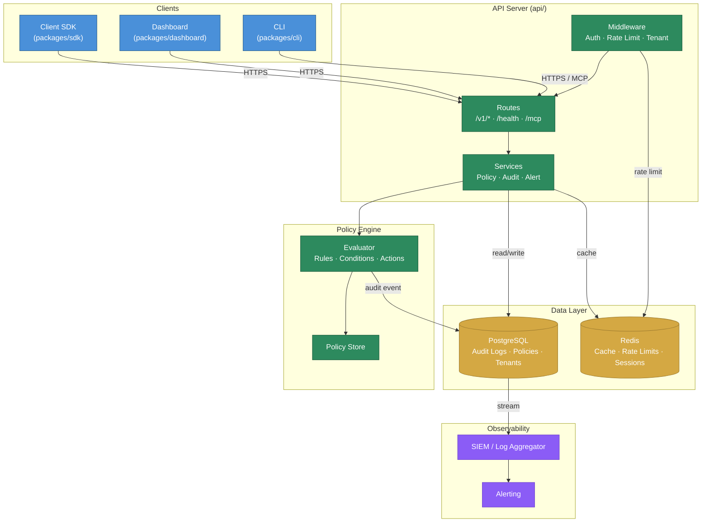

# Architecture

## Data Flow

1. **Clients** (SDK, Dashboard, CLI) send requests to the **API Server** over HTTPS.
2. **Middleware** handles authentication, rate limiting (via Redis), and tenant isolation.
3. **Routes** dispatch to **Services**, which contain the business logic.
4. The **Policy Engine** evaluates agent tool calls against stored policies and returns allow/block/approve decisions.
5. Every evaluation produces an **audit event** written to PostgreSQL.
6. Audit events are streamed to external **SIEM** integrations for monitoring and alerting.

See [`ARCHITECTURE.md`](./ARCHITECTURE.md) for the full detailed architecture document.
