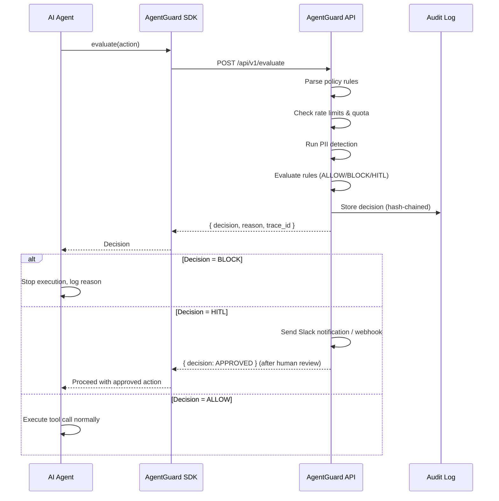

# How AgentGuard Works

Runtime security for AI agents — in three steps.

---

## The Problem

AI agents don't ship with guardrails. Left unchecked, they can exfiltrate data, execute destructive commands, and bypass access controls. Traditional firewalls can't evaluate *intent* — AgentGuard can.

## The Solution

AgentGuard sits between your AI agent and the tools it calls. Every action is evaluated against a security policy before execution. Nothing gets through without approval.

---

## How It Works — 3 Steps

### 1. Install the SDK

```typescript
// npm install @agentguard/sdk
import { AgentGuard } from '@agentguard/sdk';

const guard = new AgentGuard({
  apiKey: process.env.AGENTGUARD_API_KEY,
});
```

Or with Python:

```python
# pip install agentguard-sdk
from agentguard import AgentGuard

guard = AgentGuard(api_key=os.environ["AGENTGUARD_API_KEY"])
```

Wrap your agent's tool calls with a single `evaluate()` call. That's it.

### 2. Define Policies

Write YAML policies that describe what your agent is allowed to do:

```yaml
name: customer-service
rules:
  - effect: ALLOW
    tool: read_database
    condition: "resource.table in ['customers', 'orders']"
  - effect: BLOCK
    tool: write_database
  - effect: HITL
    tool: send_email
    condition: "resource.recipients.size > 5"
```

Ship a policy file alongside your code. The SDK picks it up automatically, or use the dashboard to manage policies at runtime.

Pre-built templates are available for common use cases: customer service, code agents, finance, HR, RAG, and more.

### 3. Monitor & Enforce

Every `evaluate()` call flows through AgentGuard's engine:

- **ALLOW** — the tool call proceeds immediately
- **BLOCK** — the tool call is denied with a reason
- **HITL** (Human-in-the-Loop) — the call is held for human approval via Slack or webhook

All decisions are recorded in a tamper-evident audit trail (SHA-256 hash chain) that you can export, search, or forward to your SIEM.

---

## Evaluation Flow



## What Makes It Different

| Capability | Detail |
|---|---|
| **Sub-millisecond evaluation** | In-process policy engine, no cold starts |
| **Tamper-evident audit** | SHA-256 hash chain — every event links to the previous one |
| **Built-in compliance templates** | EU AI Act, SOC 2, OWASP Top 10 for Agentic AI |
| **MCP proxy** | Enforce policies on Model Context Protocol servers transparently |
| **Pre-flight admission** | Block an entire MCP server connection if any tool is uncovered |
| **CI/CD gate** | GitHub Action validates agent code against policies before merge |

---

## Next Steps

- **Get started:** [Getting Started](/docs/getting-started/) — up and running in 5 minutes
- **Pricing:** [Pricing](/docs/pricing) — free tier, no credit card required
- **Self-host:** [Deployment Guide](/docs/deployment) — run on your own infrastructure
- **Enterprise:** [Enterprise Security](/docs/enterprise-security) — compliance, encryption, incident response
